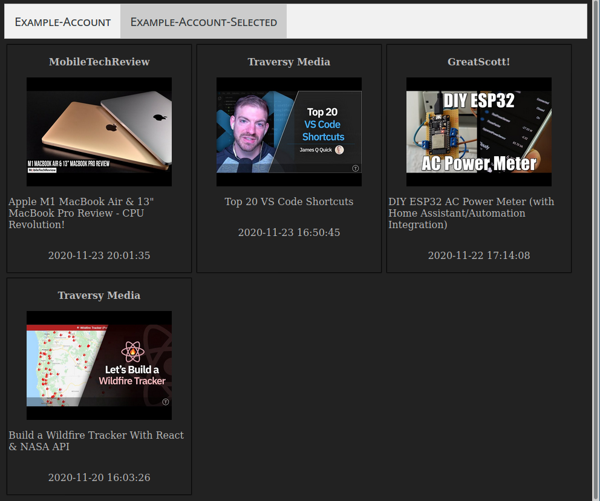

# youtubeFeeds

[What](#what)

[Building](#building)

[Usage](#usage)

<a name="what"/>

## What

you have multiple youtube accounts (or brand-/sub accounts) and want to be able to view all your feeds at once without having to arduously & slowly switch accounts?
well then, this is just the right tool for you.

youtubeFeeds is a simple feeds tiled-view generator which uses the OPML files (RSS) youtube allows one to export via this URL:

> https://www.youtube.com/subscription_manager?action_takeout=1

all you need to do is export the OPML files once for every account you have, put them into the opml subfolder and youtubeFeeds will use them to render a tiled & grouped view for you.

**Edit** Youtube has recently removed the export functionality. I have restored it with a [custom script](https://github.com/m-rei/youtube-opml-exporter-script), check it out!

here is what it looks like:

- an OPML file with a suffix of "!" sets the initially selected account

You should use "!" only once.

## Building

Just run this command

	go build

inside the root folder and it should automatically pull the dependencies and build the executable.

## Usage

Commandline arguments:

	usage:
	this <arg1> [<arg2> [<arg3]]

	arg1:	account name (identical to the file in the ./opml folder) OR
		"all" to generate an output for all (as index.html)
	arg2:	video # to check for the latest videos of a channel, default 5
	arg3:	true/false -> get duration for each video (slow!), default: false

	account name may contain a '#' suffix to indicate
	initial selection in the rendered html file
  
Best way to use it is to map this command:

	./youtubeFeeds all

to a keyboard shortcut.

it uses xdg-open to launch your default webbrowser with it!
